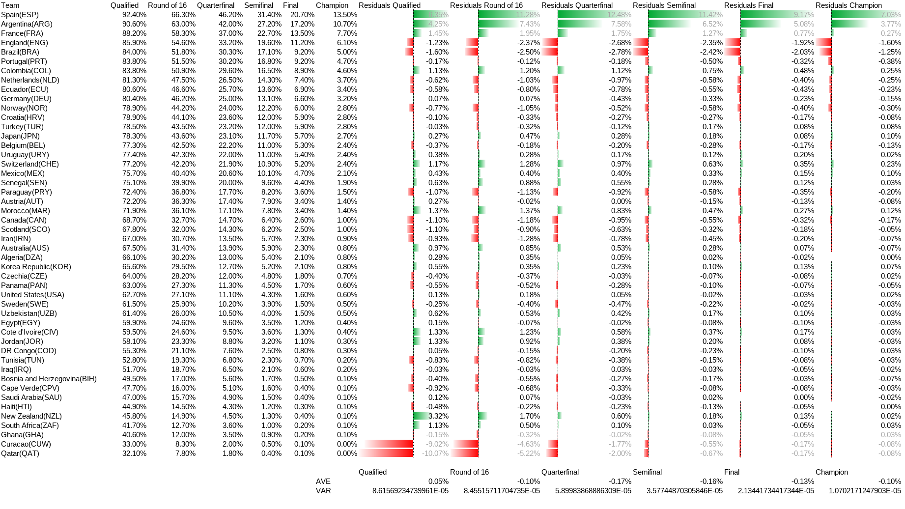
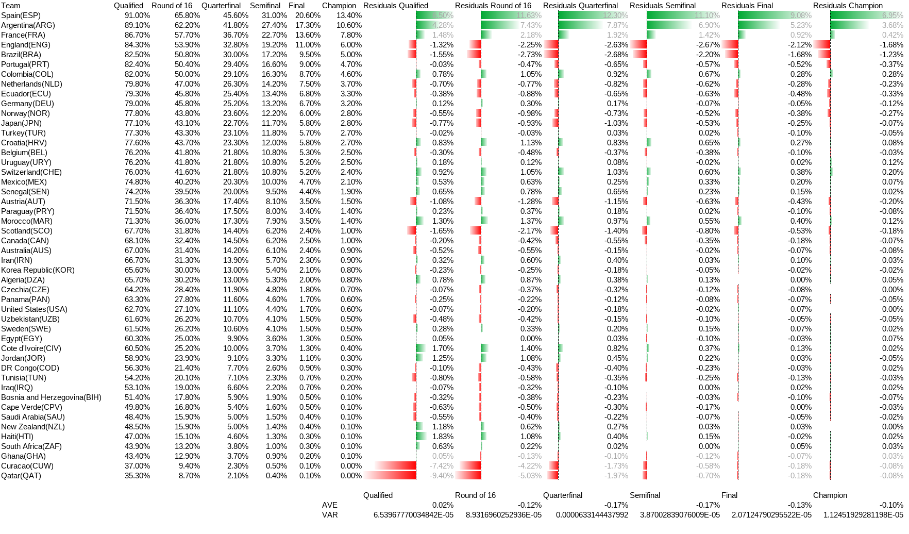
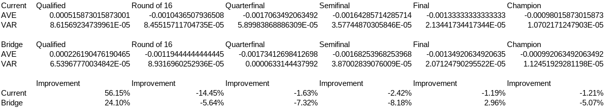

# 48队世界杯下的“三队2分桥接制”赛制设计

## 一、赛制目标

本赛制用于解决48队世界杯进入32强时的结构性问题：

1. 避免“最好第三名”横向比较；
2. 避免三队小组天然轮空；
3. 保持每队小组阶段三场比赛；
4. 保持小组阶段总场次为72场；
5. 保持全赛事总场次为104场；
6. 使32强资格尽量由直接比赛产生，而非由不同小组第三名之间的净胜球、进球数或赛程先后顺序决定。

---

## 二、基本结构

参赛队伍总数：48队。

分为16个小组，每组3队：

```text
A组、B组、C组、D组、E组、F组、G组、H组、
I组、J组、K组、L组、M组、N组、O组、P组
```

每组内三支队分别编号为：

```text
1号队、2号队、3号队
```

例如：

```text
A组：A1、A2、A3
B组：B1、B2、B3
```

---

## 三、相邻组绑定规则

16个小组两两绑定，形成8个六队赛程单元：

```text
AB、CD、EF、GH、IJ、KL、MN、OP
```

每个六队单元由两个三队小组组成。

例如：

```text
AB单元 = A组 + B组
CD单元 = C组 + D组
```

每个六队单元内部采用统一赛程模板。

---

## 四、每队比赛数量

每支球队在小组阶段共踢3场：

```text
2场组内赛 + 1场跨组赛
```

组内赛：对阵本组另外两支球队。

跨组赛：对阵绑定相邻组中的一支球队。

---

## 五、AB单元标准赛程模板

以A组和B组为例：

```text
A组：A1、A2、A3
B组：B1、B2、B3
```

三轮赛程如下：

| 轮次  | 比赛1      | 比赛2      | 比赛3      |
| --- | -------- | -------- | -------- |
| 第1轮 | A1 vs A2 | A3 vs B1 | B2 vs B3 |
| 第2轮 | A1 vs A3 | A2 vs B2 | B1 vs B3 |
| 第3轮 | A2 vs A3 | A1 vs B3 | B1 vs B2 |

该模板下，每支球队比赛如下：

```text
A1：A2、A3、B3
A2：A1、A3、B2
A3：A1、A2、B1

B1：B2、B3、A3
B2：B1、B3、A2
B3：B1、B2、A1
```

因此每队均为：

```text
2场本组比赛 + 1场跨组比赛
```

不存在轮空。

---

## 六、全赛事排赛规则

所有相邻组均套用同一模板。

例如CD单元：

```text
C组：C1、C2、C3
D组：D1、D2、D3
```

赛程为：

| 轮次  | 比赛1      | 比赛2      | 比赛3      |
| --- | -------- | -------- | -------- |
| 第1轮 | C1 vs C2 | C3 vs D1 | D2 vs D3 |
| 第2轮 | C1 vs C3 | C2 vs D2 | D1 vs D3 |
| 第3轮 | C2 vs C3 | C1 vs D3 | D1 vs D2 |

其余EF、GH、IJ、KL、MN、OP单元同理。

---

## 七、小组积分计算

每支球队的三场比赛全部计入其本组积分。

例如A组排名只统计：

```text
A1、A2、A3三队各自三场比赛所得积分
```

其中包括：

```text
2场A组组内赛
1场对B组球队的跨组赛
```

B组同理。

跨组赛结果同时计入双方所在小组的积分表。

---

## 八、积分规则

本赛制组内赛部分沿用国际足球通行规则：

```text
胜：3分
平：1分
负：0分
```

每组按以下顺序排名：

1. 积分；
2. 净胜球；
3. 总进球数；
4. 相互比赛积分；
5. 相互比赛净胜球；
6. 相互比赛进球数；
7. 公平竞赛积分；
8. 抽签或赛前排名规则。

其中第4至第6项只适用于相关球队之间有直接交手的情况。

在配套模拟程序中，由于没有公平竞赛积分数据，最后两级兜底规则处理为：

```text
7. rating；
8. 随机兜底值。
```

该处理只用于模拟程序中的不可分情况，不改变正式赛制可采用公平竞赛积分或抽签规则的原则。

本赛制跨组赛部分使用原创规则：

```text
胜：2分
负：0分
平：无
```

跨组赛应当首先进行90分钟标准比赛。若90分钟平局，直接进入点球大战决定跨组赛胜者。

点球大战只决定2分归属，不计入进球数，也不影响净胜球。

例如：

```text
A 1-1 B
A 点球胜
```

则记为：

```text
A：进球1，失球1，净胜球0，跨组赛胜，得2分
B：进球1，失球1，净胜球0，跨组赛负，得0分
```

该设置避免了跨组赛作为“双方没有直接利害关系”的比赛，双方“默契”达成平局赚取1分的局面，也避免了潜在的“对手强度不一致”导致的外组影响过大的问题。

同时，跨组赛胜利获得2分，不足以改写组内比赛的局面，因为：

```text
跨组胜利 < 组内胜利
跨组胜利 = 两场组内平局
跨组胜利 > 一场组内平局
```

仅看某组组内赛3场表现会出现如下积分形态：

```text
6-3-0, 6-1-1, 4-4-0, 4-3-1, 4-2-1, 3-3-3, 2-2-2
```

当球队组内赛2场全胜/全败时，跨组赛不产生任何实际影响；仅当有平局出线时（即说明组内无法区分强度），跨组赛的作用才会体现。

在三队组内赛全部打平的情况下，跨组赛胜者将获得额外2分。若仍有球队同分，则继续按照净胜球、总进球数和相互比赛规则排序。

---

## 九、晋级规则

16个小组，每组前二晋级32强：

```text
16组 × 2队 = 32队
```

每组第三名直接淘汰。

不存在“最好第三名”。

不存在跨组第三名横向比较。

---

## 十、场次核算

### 1. 每个六队单元

每个相邻组单元有6支队。

每轮3场，共3轮：

```text
3轮 × 3场 = 9场
```

### 2. 小组阶段总场次

共有8个六队单元：

```text
8 × 9 = 72场
```

### 3. 淘汰赛阶段

32强单败淘汰赛：

```text
32强：16场
16强：8场
8强：4场
半决赛：2场
决赛：1场
三四名决赛：1场
```

淘汰赛合计：

```text
16 + 8 + 4 + 2 + 1 + 1 = 32场
```

### 4. 全赛事总场次

```text
小组阶段72场 + 淘汰赛32场 = 104场
```

与现行48队、12组4队、前二加最好第三名的104场总场次相同。

---

## 十一、与现行48队赛制对比

| 项目          |      现行12组×4队赛制 |       相邻组三队桥接制 |
| ----------- | --------------: | -------------: |
| 总队数         |              48 |             48 |
| 小组数         |             12组 |            16组 |
| 每组队数        |              4队 |             3队 |
| 每队小组赛       |              3场 |             3场 |
| 小组阶段总场次     |             72场 |            72场 |
| 淘汰赛场次       |             32场 |            32场 |
| 总场次         |            104场 |           104场 |
| 晋级方式        |   小组前二 + 8个最好第三 |           每组前二 |
| 是否有最好第三名    |               有 |              无 |
| 是否需要第三名横向比较 |              需要 |            不需要 |
| 是否存在小组轮空    |               无 |              无 |
| 是否存在跨组影响    | 存在，且发生在第三名横向比较中 | 存在，但通过固定跨组比赛体现 |

---

## 十二、赛制优势

### 1. 消除“最好第三名”问题

现行赛制中，12个小组第三名需要横向比较，容易产生：

```text
跨组算分
信息差
最后一轮默契球
晚开球小组拥有优势
早完赛球队只能等待
```

本赛制中，每组固定前二晋级，第三名全部淘汰，不存在第三名横向比较。

---

### 2. 消除三队小组轮空问题

普通三队小组赛程为：

```text
A vs B
A vs C
B vs C
```

每轮必然有一队轮空，最后一轮容易出现信息差。

本赛制通过相邻组跨组赛补足轮空，使每队三轮都有比赛。

---

### 3. 场次不增加

本赛制小组阶段仍为72场，总赛事仍为104场。

它不是通过增加比赛来解决问题，而是重组原有72场小组赛的结构。

---

### 4. 不确定性前置

传统抽签中本来就存在死亡之组和弱组。

本赛制将不确定性主要前置到抽签阶段和固定跨组赛中，而不是后置到最后一轮的第三名横向比较中。

即：

```text
抽签运气可以接受；
赛程后段的信息差与跨组算分应尽量减少。
```

---

## 十三、主要风险

### 1. 跨组赛对手强弱不均

由于每队有一场跨组赛，不同球队的跨组对手强度可能不同。这是本赛制的主要不公平来源。

但该问题与传统世界杯中的“死亡之组”类似，属于抽签结构的一部分，而非赛程后段动态信息差。

同时基于跨组赛的新积分方式，这种外部影响在组内的实际影响上将被很大程度上削减。

---

### 2. 跨组赛激励结构

跨组赛同时影响两个小组的排名，因此必须避免将跨组赛设计成双方都可以从平局中获利的比赛。

本方案采用：

```text
跨组赛胜者得2分；
负者得0分；
90分钟平局后点球决胜；
点球不计入进球数和净胜球。
```

该设置消除了跨组赛中的“平局各取1分”激励。即使90分钟打平，双方仍必须通过点球产生一个2分获得者。

仍需承认的是，任何小组赛制都不能绝对消除最后一轮的策略性比赛。本方案的处理方式是：

```text
1. 同一六队单元第三轮三场同时开球；
2. 跨组赛不提供平局积分；
3. 每组只取前二，不存在第三名跨组等待结果。
```

因此，本方案的风险主要集中在同一六队单元内部，而不是扩散为不同小组第三名之间的全局横向计算。

---

### 3. 最后一轮仍需同步开球

为了减少信息差，同单元第三轮所有比赛必须同时开球。

即：

```text
AB单元第三轮三场同时开球；
CD单元第三轮三场同时开球；
……
OP单元第三轮三场同时开球。
```

---

## 十四、执行细则

### 1. 抽签步骤

本赛制中，A1、A2、A3……P1、P2、P3均为赛前预设签位，而非抽签后由组织者分配的队内编号。

每一个签位在抽签前已经对应确定以下内容：

1. 所属小组；
2. 小组赛三轮对阵；
3. 跨组赛对手；
4. 小组赛比赛轮次；
5. 淘汰赛潜在路径。

抽签时，各参赛队直接抽取具体签位，例如A3、B1、P2，而不是先抽取小组再由组织者分配编号。

除非为满足赛前已经公布的分档原则、洲际回避原则或东道主固定落位原则，任何球队不得在抽签后被重新编号、重新换位或重新桥接。

所有桥接关系、赛程模板和淘汰赛签表在抽签前即为固定，不得根据抽签结果、球队强弱、商业价值或转播需求进行调整。

---

### 2. 相邻组绑定不可临时调整

绑定关系赛前固定：

```text
AB、CD、EF、GH、IJ、KL、MN、OP
```

不得根据抽签强弱临时更换绑定关系。

---

### 3. 赛程模板不可临时调整

每个相邻组单元必须使用同一模板。

以XY单元为一般形式：

```text
X组：X1、X2、X3
Y组：Y1、Y2、Y3
```

赛程为：

| 轮次  | 比赛1      | 比赛2      | 比赛3      |
| --- | -------- | -------- | -------- |
| 第1轮 | X1 vs X2 | X3 vs Y1 | Y2 vs Y3 |
| 第2轮 | X1 vs X3 | X2 vs Y2 | Y1 vs Y3 |
| 第3轮 | X2 vs X3 | X1 vs Y3 | Y1 vs Y2 |

---

## 十五、核心结论

本赛制可概括为：

```text
48队分16组三队；
相邻两组绑定成六队单元；
每队踢两场组内赛和一场跨组赛；
每组前二晋级32强；
小组阶段72场；
淘汰赛32场；
总计104场。
```

本赛制的核心价值在于：

```text
用一场预设跨组比赛，替代最好第三名横向比较。
```

它不能完全消灭抽签运气，也不能绝对消灭默契球。

但它可以显著减少现行48队赛制中最严重的问题：

```text
第三名跨组算分
赛程先后信息差
晚开球小组掌握上帝视角
早完赛球队无法回应
```

因此，本赛制是一个在总场次不增加、每队小组赛场次不增加的前提下，比现行“12组4队+最好第三名”更结构化、更可解释、更少补丁的48队世界杯赛制方案。

---

## 十六、淘汰赛最大分隔签表

本赛制的小组阶段桥接关系固定为：

```text
AB、CD、EF、GH、IJ、KL、MN、OP
```

淘汰赛签表采用“最大分隔”原则，目的在于：

```text
1. 将同组第1名与第2名分入不同半区；
2. 拉开相邻桥接单元内球队在淘汰赛中的距离；
3. 尽量避免小组阶段已存在跨组赛关系的球队过早再次相遇。
```

32强签表如下：

```text
左半区：
A1-P2
C1-N2
B1-O2
D1-M2
E1-L2
G1-J2
F1-K2
H1-I2

右半区：
I1-H2
K1-F2
J1-G2
L1-E2
M1-D2
O1-B2
N1-C2
P1-A2
```

其中：

```text
X1 = X组第1名
X2 = X组第2名
```

该签表不改变以下基本结构：

```text
每队小组阶段3场；
每队2场组内赛、1场跨组赛；
每组前二晋级；
小组阶段72场；
淘汰赛32场；
全赛事总计104场。
```

配套模拟程序 `new_format_simulator.py` 使用的正是上述32强签表。

---

## 十七、量化模拟口径

本赛制配套使用 `new_format_simulator.py` 进行蒙特卡洛模拟。

模拟程序的作用不是预测某一届真实世界杯的具体结果，而是比较赛制结构在大量随机抽签和随机赛果下产生的长期概率分布。

### 1. 随机抽签

每次模拟前，48支球队随机洗牌并依次填入：

```text
A1、A2、A3、
B1、B2、B3、
……
P1、P2、P3
```

因此模拟结果同时包含：

```text
球队强度影响；
抽签随机性影响；
赛制结构影响。
```

### 2. 比赛模型

小组赛使用泊松模型生成90分钟比分。

淘汰赛、点球大战以及必须产生胜者的情形，使用基于rating的二选一胜率模型，并加入单场状态波动。

跨组赛若90分钟平局：

```text
90分钟比分计入进球数和净胜球；
点球胜者获得跨组赛2分；
点球不计入进球数和净胜球。
```

### 3. 排名与输出

模拟程序按以下字段输出每队概率：

```text
Qualified
Round of 16
Quarterfinal
Semifinal
Final
Champion
```

其中：

```text
Qualified = 小组前二，进入32强；
Round of 16 = 通过32强赛；
Quarterfinal = 通过16强赛；
Semifinal = 通过8强赛；
Final = 通过半决赛；
Champion = 赢得决赛。
```

### 4. 可复现性

模拟程序支持随机种子：

```bash
python3 new_format_simulator.py 10000 -w 8 --seed 2026
```

在模拟次数、工作线程数和seed相同的情况下，输出结果可复现。

### 5. 对比方式

若需要与12组赛制进行量化对比，可使用相同球队rating、相同模拟次数、相同工作线程数和相同seed分别运行：

```bash
python3 current_format_simulator.py 10000 -w 8 --seed 2026
python3 new_format_simulator.py 10000 -w 8 --seed 2026
```

两者输出字段一致，因此可以直接比较各队在不同赛制下的阶段概率。

---

## 十八、统计结果展示

本节展示基于固定随机种子的模拟统计结果。

两套赛制均使用以下随机种子运行：

```bash
--seed 2026
```

统计结果用于观察两套赛制在不同阶段的概率稳定性，尤其是小组出线阶段是否更少受到抽签结构扰动。

### 1. K6残差定义

本节引入 `K6残差` 作为展示指标。

对某一球队，在某一阶段的胜率上，取其强度排序附近6支球队的阶段胜率平均值，并与该队自身阶段胜率比较：

```text
K6残差 = 附近6队阶段胜率平均值 - 该队阶段胜率
```

该指标用于观察：

```text
某队的模拟胜率是否明显偏离其附近强度球队的平均水平。
```

对于强度排名最高或最低的3支球队，由于不存在完整的“上三队”或“下三队”，展示表中使用“附近6队”作为参考值。但这些边界球队不计入最终的K6残差平均值与方差计算。

### 2. 统计口径

对以下各阶段胜率分别计算K6残差：

```text
Qualified
Round of 16
Quarterfinal
Semifinal
Final
Champion
```

并对每一阶段统计：

```text
K6残差平均值
K6残差方差
```

平均值用于观察整体偏离方向，方差用于观察不同球队之间偏离程度是否集中。

### 3. 12组赛制统计表

下图为12组赛制在 `--seed 2026` 下的模拟统计结果：



### 4. 桥接赛制统计表

下图为桥接赛制在 `--seed 2026` 下的模拟统计结果：



### 5. 汇总对比表

下图为两套赛制各阶段K6残差平均值与方差的汇总对比：



### 6. 统计结论

从本次模拟结果看，桥接赛制的优势主要体现在32强出线阶段。

在 `Qualified` 阶段：

```text
K6残差平均值降低约56%；
K6残差方差降低约24%。
```

这说明桥接赛制在“小组出线资格如何产生”这一层面，相比12组赛制更能降低局部抽签结构对出线概率的扰动。

但进入淘汰赛后，该优势并不稳定。部分淘汰赛阶段中，桥接赛制的K6残差方差略高于12组赛制。

因此，本次模拟更支持以下结论：

```text
桥接赛制改善小组出线结构。
```

而不应被扩大解释为：

```text
桥接赛制全面改善所有阶段结果。
```
